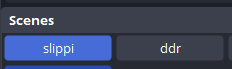
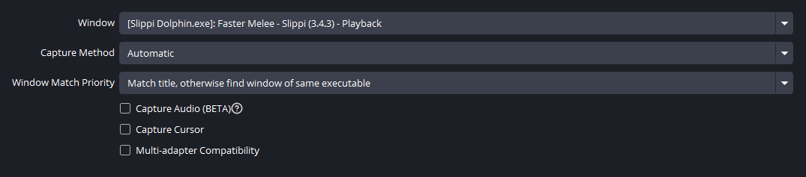
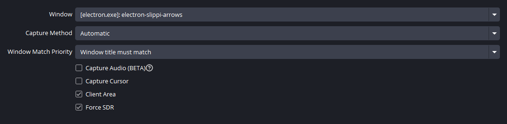

# ddr-slippi
This is a collection of scripts and tools to generate input overlays from a Slippi replay on Windows in the style of Dance Dance Revolution:


The tricky part is recording the characters and the stage separately, so they can be composited together with the arrow animations. As it stands, to run it yourself you will need to configure:
- OBS websocket settings
- OBS recording settings
- Slippi playback settings

on your machine, and setup `data/config.json`. Instructions are below for all of them.

You will also need to copy your target replay file to `data/game.slp`, and specify the frame ranges to record.

I was not able to default enable the develop mode backgrounds and fix the camera, so you'll want to give yourself a ~10s buffer before your clip to toggle that in the replay, then press `ENTER` in the terminal to manually start the recording. Subsequent recordings of the stage background and inputs will sync to your manual start point.

The relevant button sequences to turn on green screen for the first recording:
- `X + DPad Down` until green screen
- `DPad up` until the camera is fixed. If playback starts from the beginning, then you won't need to fix the camera.

Make sure there is no other Dolphin open, or else it will steal your controller input.

After setting the real start point on the first recording, the rest should be automatic.

## Setup
### Slippi
You'll need to configure your playback Slippi to open at the same resolution. Some useful settings suggestions:
- Graphics -> Auto adjust window size turn ON
- Graphics -> Render to main window turn ON
- Graphics -> Aspect Ratio: set to a fixed ratio so auto adjust window size works properly
- Graphics -> Use fullscreen OFF - you'll need to be able to press {ENTER} into the terminal when you want to start recording on the first clip

For the recording file, you'll need to put your `.slp` into `data/` as `game.slp`. You can go straight to the file on your machine from the Slippi launcher by clicking the triple-dots and selecting "Reveal location"

To gather the frame ranges, you can turn on (in Dolphin) `Config -> Interface -> On-screen display messages` and `Config-> Slippi -> Display frame index`. I suggest turning the latter option on and toggling the former option so that you don't have to deal with other on screen display messages polluting the recording when you're done gathering the frame range.

### OBS
You'll need the latest version of OBS (31.0.0 at the time of writing) to utilize the new websocket protocol. Then,
- Tools (at the top) -> WebSocket Server Settings
- Enable WebSocket server

You can find the server IP and port for the next step under "Show Connect Info"

You'll need 2 scenes created with specific names and accessible for the program:
- `slippi` (configured to record the slippi playback exe)
- `ddr` (configured to record the electron window that plays the arrows back)


There are many guides online to customizing recording for slippi, but in order for things to work it will need to not get stuck when switching scenes. I've found that window captures generally work better for Dolphin than game captures, although game captures can be more performant if they do work.


For `ddr`, you can (after following the building steps below) run `npm start` to launch the electron window that will host the arrows playback, and set up your OBS scene while it's running.


### config.json
All paths in `data/config.json` need to be set up in order for things to work. You can make a new file `data/config.local.json` if you want to contribute without accidentally checking in your own paths.

For reference:
```json
{
    "obs_websocket": {
        // for ipv6 (the ugly ones), enclose the address in 
        // [] as shown. Otherwise, remove the [] and paste 
        // the ipv4 address, e.g. "ws://192.168.0.1"
        "ip": "ws://[ffff:ffff:ffff:ffff:ffff:ffff:ffff:ffff]", 
        // self-explanatory
        "port": "1010" 
    },

    // You can find the root path to your playback Slippi by
    // going to the Slippi Launcher -> Settings -> Playback -> "Open settings folder".
    // The relative paths after that should be similar. 
    // Don't forget to use \\ instead of \ for the separators. 
    // You may need to have opened a replay from the launcher before in order to generate GALE01.ini
    "slippi_replay_gecko_path": "C:\\Users\\username\\AppData\\Roaming\\Slippi Launcher\\playback\\User\\GameSettings\\GALE01.ini",
    "slippi_replay_exe_path": "C:\\Users\\username\\AppData\\Roaming\\Slippi Launcher\\playback\\Slippi Dolphin.exe",

    // Full path to the SSBM .iso to use when launching playback. Same rules for \\ apply.
    "ssbm_iso_path": "C:\\Users\\username\\Downloads\\GALE01.iso",
    // The connect code you use in the replay .slp
    "your_connect_code": "D#10"
}
```

## Building
You'll need to install a modern version of `NodeJS`, then
`npm install` in the root directory, then `npm ./ddr-slippi.js` will begin execution. There are currently no built binaries for this project, so you'll have to `git clone` the project yourself.

`/data` contains configuration files.

`/assets` contains all images used for the animations. Currently `Y` and `LT` are not parsed or played back, but can easily be added if you look into `replayer.js`, `ddr.html`, and `get-inputs.js`. The assets already exist and are named as expected.

Recordings are saved to `/videos`.

Adding a new configuration archives the previous `game.slp` and `playback.json` into `/old`.

## Outputs
After getting everything set up, this program will automatically(ish):
- Enable dev mode background gecko codes
- Record a green-screened video of just the characters
- Enable character and particle effect hiding gecko codes
- Record a video of just the camera moving around the stage, using the exact frame ranges as the first video
- Generate `ddr.json`, a data file containing all the inputs of the frame range for your player
- Play back the inputs into an Electron window rendering the arrows, and record that - it should be almost 3 seconds longer, but it will be a consistent offset from the gameplay clips to make it simple to composite
- Optionally record the original clip without any visual changes
- Reset gecko codes for future playback
- Reset OBS settings to prior config
- All outputs go to `videos/{frame_end_number}-{opponent connect code}/`

## Compositing
This does not currently do any `ffmpeg` magic to automatically composite the videos, but you can easily use something like AE to stack and chroma-key the videos. You'll need to figure out the sync points for each video the first time you make the composition, but they should be constant if you drop matching videos from a new clip.

If you record in `.mkv` and want to turn them into `.mp4`, you can use the provided `make-mp4.ps` script by passing the folder name in `/videos` 

e.g. `$> make-mp4.ps1 2160-D#10` or just run the `ffmpeg` command yourself: 

`ffmpeg -i filename.mkv -codec copy filename.mp4`

You can install `ffmpeg` via `winget`: `winget install ffmpeg`

## Known issues
- Yoshi (most especially, blue Yoshi) due to the green on the eggs and for blue Yoshi especially, the lack of alternatives for chroma keying (pink boots, blue body, green eggs)
- Luigi (same issues)
- Ledges and platforms get wonky sometimes, because you're compositing the players over the stage. When you're actually supposed to be behind them, it will look funny. You can potentially record a third version of the clip with just the stage and no background and fix it during compositing, although I haven't found a good set of Gecko codes to achieve that look for all stages.
- Error handling - the code does the bare minimum to attempt to undo all the configuration changes, even when an exception is thrown, but you can easily misconfigure things and overwrite some OBS/Dolphin settings.
